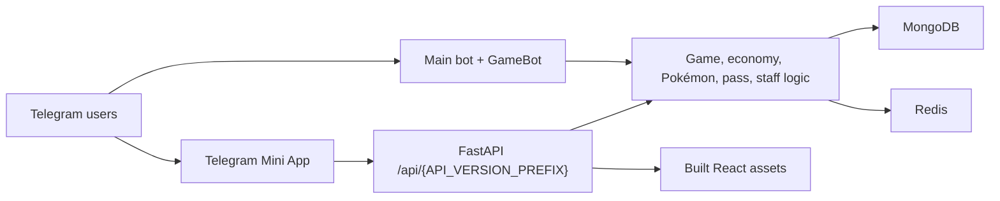

# Seal-Bot

Production Telegram character-collection bot with a secondary game bot, FastAPI backend, and React Telegram Mini App.

Repository: https://github.com/bisug/seal-your-waifu-bot

[](https://www.python.org/)
[](https://fastapi.tiangolo.com/)
[](https://react.dev/)
[](https://vite.dev/)
[](https://bun.sh/)
[](https://www.mongodb.com/)
[](https://redis.io/)
[](https://www.docker.com/)

## At A Glance

| Area | What it does | Main paths |
| --- | --- | --- |
| Main bot | Character drops, catching, economy, Pokémon, quests, battle pass, staff tools | `backend/modules`, `backend/core` |
| Game bot | Name guessing, quizzes, scramble games, game leaderboards | `backend/modules/gamebot` |
| Backend | FastAPI API, Telegram Mini App auth, WebSocket updates, static asset serving | `backend/webapp` |
| Frontend | React/Vite Telegram Mini App for users and staff | `frontend` |
| Data | MongoDB persistence and Redis hot-path cache/session storage | `backend/database` |
| Deploy | Docker image plus Heroku, Render, Railway, Koyeb, VPS, and static frontend guides | `backend/Dockerfile`, `render.yaml`, `railway.json`, `heroku.yml`, `koyeb.yaml`, [`docs/deployment`](docs/deployment/README.md) |



## Contents

- [Quick Start](#quick-start)
- [Security](#security)
- [Project Layout](#project-layout)
- [Architecture](#architecture)
- [Configuration](#configuration)
- [Development Commands](#development-commands)
- [Bot Features](#bot-features)
- [Anti-Abuse And Fairness](#anti-abuse-and-fairness)
- [Mini App](#mini-app)
- [API Reference](#api-reference)
- [Data Storage](#data-storage)
- [Deployment](#deployment)
- [GitHub Actions](#github-actions)
- [Operations](#operations)
- [Troubleshooting](#troubleshooting)

## Quick Start

1. Install backend dependencies:

   ```bash
   cd backend
   uv sync
   cd ..
   ```

2. Install frontend dependencies:

   ```bash
   cd frontend
   bun install
   cd ..
   ```

3. Create your local environment file:

   ```bash
   cp backend/.env.example backend/.env
   ```

   Windows PowerShell:

   ```powershell
   Copy-Item backend/.env.example backend/.env
   ```

4. Fill the required values in `backend/.env`.

5. Run the full backend plus Telegram bots:

   ```bash
   cd backend
   uv run uvicorn backend.webapp.main:app --host 0.0.0.0 --port 8000 --workers 1
   ```

6. Run the frontend dev server in another terminal:

   ```bash
   cd frontend
   bun run dev
   ```

> Production rule: run only one ASGI worker per bot token. Multiple workers can start duplicate Telegram clients.

## Security

Never commit real bot tokens, Telegram API credentials, MongoDB URLs, Redis URLs, or image host keys.

Use `.env.example` as the safe template. Store production secrets in the host's secret manager or in a private `.env` file.

Before production:

- Rotate any credential that has ever been public.
- Keep `.env` out of version control.
- Use HTTPS for `WEB_APP_URL`.
- Restrict `OWNER_ID` and `SUDO_USERS` to trusted Telegram user IDs.
- Keep `LOG_FILE_ENABLED=false` in containers unless a writable log volume is configured.
- Remember that frontend `VITE_*` variables are public browser values, not secrets.

## Project Layout

```text
Seal-bot/
├── backend/
│   ├── backend/                 # Python package
│   │   ├── __init__.py          # Bot clients, global role state, shared exports
│   │   ├── __main__.py          # Bot-only entrypoint: python -m backend
│   │   ├── client.py            # SealClient, module loading, command sync, send helpers
│   │   ├── runner.py            # Startup/shutdown orchestration
│   │   ├── core/                # Cache, sessions, progression, Pokémon, spawns, resources
│   │   ├── database/            # MongoDB, Redis, collection exports, indexes
│   │   ├── modules/             # Telegram command handlers
│   │   ├── static/              # Built Mini App assets served by FastAPI
│   │   └── webapp/              # FastAPI app, auth, API routes, WebSockets, schemas
│   ├── config.py                # Environment-driven runtime configuration
│   ├── pyproject.toml           # Python dependency manifest
│   ├── uv.lock                  # Python lockfile
│   ├── .python-version          # Python version for local tooling and CI
│   ├── .env.example             # Safe environment template
│   ├── scripts/                 # Maintenance scripts
│   ├── tests/                   # Backend test suite
│   ├── compose.yaml             # Docker Compose service
│   └── Dockerfile               # Multi-stage production image
├── frontend/
│   ├── src/                     # React Mini App source
│   ├── public/                  # Static frontend assets and SPA redirects
│   ├── package.json             # Bun scripts and frontend dependencies
│   ├── bun.lock                 # Frontend lockfile
│   ├── vercel.json              # Vercel config
│   ├── netlify.toml             # Netlify config
│   └── wrangler.toml            # Cloudflare Pages config
├── .github/workflows/ci.yml     # Backend, frontend, and Docker CI
├── heroku.yml                   # Heroku container deploy config
├── railway.json                 # Railway deploy config
├── render.yaml                  # Render deploy config
├── koyeb.yaml                   # Koyeb deploy config reference
├── docs/deployment/             # Per-platform deployment guides
└── README.md
```

## Architecture

### Entrypoints

| Entrypoint | Purpose |
| --- | --- |
| `backend.webapp.main:app` | Unified ASGI app. Starts Telegram bots in FastAPI lifespan, serves API and Mini App. |
| `python -m backend` | Bot-only process. Starts Telegram bots and idles without FastAPI. |
| `backend/Dockerfile` | Production image. Installs backend dependencies, serves Uvicorn on `${PORT:-8080}`. Frontend is **not** bundled (see below). |

### Bot Clients

| Client | Credential | Purpose |
| --- | --- | --- |
| `app` / `MainBot` | `TOKEN` | Main collection, economy, social, progression, admin, and Mini App bot. |
| `game_bot` / `GameBot` | `SUB_TOKEN` | Secondary quiz, scramble, and name-guess bot. |

### Startup Flow

At startup, `backend.runner.start_bots()`:

1. Loads DB-backed staff roles.
2. Verifies MongoDB and Redis.
3. Ensures MongoDB indexes.
4. Verifies the Pokémon catalog is populated (run `scripts/pokemon_import.py` once).
5. Starts main bot and game bot.
6. Syncs Telegram command lists.
7. Starts background tasks for deletion, spawn flushing, resources, leaderboards, and maintenance.
8. Configures the main bot menu button to open `WEB_APP_URL#shop`.

Shutdown cancels background tasks, stops clients, flushes message counts, closes Redis, and closes MongoDB.

### Module Loading

`backend.modules.__init__` recursively discovers every Python file under `backend/modules`, excluding `__init__.py`. Modules either register handlers through decorators such as `@app.on_message(...)` or expose `load_handlers(bot)`.

## Requirements

| Area | Requirement |
| --- | --- |
| Backend | Python `>=3.14`, `uv`, MongoDB, Telegram credentials |
| Cache | Redis-compatible service strongly recommended |
| Frontend | Bun `1.3.14`, React 19, Vite 8, TypeScript, Tailwind CSS v4 |
| Production | Docker-compatible host or another persistent Python process host |
| Telegram Mini App | Public HTTPS URL |

## Configuration

### Required Environment

| Variable | Purpose |
| --- | --- |
| `TOKEN` | Main Telegram bot token. |
| `SUB_TOKEN` | Secondary GameBot token. |
| `API_ID` | Telegram API ID from my.telegram.org. |
| `API_HASH` | Telegram API hash from my.telegram.org. |
| `MONGO_URL` | MongoDB connection string. |
| `WEB_APP_URL` | Public HTTPS URL for the Mini App/backend. |
| `OWNER_ID` | Primary owner Telegram user ID. |

### Recommended Environment

| Variable | Purpose |
| --- | --- |
| `REDIS_URL` | Sessions, rate limits, leaderboards, spawn state, and hot reads. |
| `SUDO_USERS` | Comma-separated startup moderators. DB roles can add more later. |
| `MAIN_GROUP_ID` | Main community/group ID used by logs and giveaway notifications. |
| `GALLERY_CHANNEL_ID` | Channel where uploaded character media is posted or edited. |
| `LOG_GROUP_ID` | Review/log group for startup reports and update proposals. |
| `SUPPORT_CHAT` | Support chat username used in buttons and starter checks. |
| `UPDATE_CHAT` | Update channel username used in buttons and starter checks. |
| `PHOTO_URL` | Comma-separated fallback/start images. |
| `IMGBB_API_KEY` | Optional image host key for upload fallback paths. |
| `MINI_APP_SHORT_NAME` | BotFather Mini App short name. Defaults to `app`. |
| `API_VERSION_PREFIX` | API path prefix. Defaults to `v1_7b82`. |

### Logging And Resource Controls

| Variable | Default | Purpose |
| --- | --- | --- |
| `LOG_LEVEL` | `INFO` | `DEBUG`, `INFO`, `WARNING`, `ERROR`, or `CRITICAL`. |
| `LOG_FORMAT` | `text` | `text` or `json`. Use `json` for centralized logging. |
| `LOG_FILE_ENABLED` | `false` | Write rotating file logs in addition to stdout. |
| `LOG_DIR` | `logs` | Directory for rotating file logs. |
| `RESOURCE_MONITOR_ENABLED` | `true` | Enable process memory/task monitoring. |
| `RESOURCE_CHECK_INTERVAL_SECONDS` | `60` | Resource monitor interval. |
| `RESOURCE_MEMORY_SOFT_LIMIT_MB` | `0` | Soft RSS limit. `0` auto-detects. |
| `RESOURCE_MEMORY_HARD_LIMIT_MB` | `0` | Hard RSS limit. `0` auto-detects. |
| `RESOURCE_TASK_SOFT_LIMIT` | `500` | Background task warning threshold. |

## Development Commands

| Task | Command |
| --- | --- |
| Install backend deps | `uv sync` |
| Run backend + bots | `uv run uvicorn backend.webapp.main:app --host 0.0.0.0 --port 8000 --workers 1` |
| Run bots only | `uv run python -m backend` |
| Install frontend deps | `cd frontend && bun install` |
| Run frontend dev server | `cd frontend && bun run dev` |
| Build frontend | `cd frontend && bun run build` |
| Backend validation | `uv run python -m compileall -q config.py backend scripts` |
| Frontend lint | `cd frontend && bun run lint` |
| Frontend type-check | `cd frontend && bun run type-check` |
| Docker build | `docker build -t seal-bot:ci backend` |

The backend Docker image no longer bundles the frontend. To serve the Mini App from FastAPI, build the frontend and copy `frontend/dist` into `backend/backend/static` before building the image, or host the frontend separately (see [Static Frontend Hosting](#static-frontend-hosting)).

## Bot Features

### Game Loop

1. Group chat messages are tracked by global sync handlers.
2. Spawn frequency adapts to recent active users:
   - `6+` active users: about every `40` messages.
   - `3-5` active users: about every `60` messages.
   - Lower activity: chat frequency or up to `80` messages.
3. Golden Hour runs from `20:00` through `22:59` UTC and halves the target message count.
4. Active spawn state is stored in Redis with MongoDB fallback.
5. Users catch with `/seal <name>`.
6. Correct catches clear the spawn, add the character, grant XP, update quests, and check achievements.

`/seal` accepts exact normalized names and non-trivial word subsets. Example: `Light` can catch `Light Yagami`, but one-letter guesses are rejected.

### Pokémon

Full Pokémon system powered by [PokéAPI](https://pokeapi.co) data (1025 species, Gen 1-9):

- **Starters**: `/starter` — one-time pick of Bulbasaur, Charmander, Squirtle, Pikachu, or Eevee at level 5.
- **Active partner**: `/setpokemon <dex>` — your partner earns XP from battles and guess games.
- **Leveling**: partners gain XP (`level * 100` per level) from battle wins (+40), battle losses (+15), and Pokémon guess spawns (+25).
- **Evolution**: partners auto-evolve at stage thresholds (level 16 for stage 1→2, 32 for 2→3). Branching lines (Eevee) pick a random unowned evolution. The active pointer follows the evolution.
- **Battles**: `/battle <bet>` uses level-scaled base stats with the full 18×18 type-effectiveness chart — super effective hits deal 2×+, immunities deal zero.
- **Guess spawns**: every 8th spawn slot is a spoilered Pokémon artwork — first correct name in chat wins 150 coins + XP for user and partner.
- **Pokédex**: `/pokedex <name or dex>` in chat; full detail (stats, abilities, breeding, evolution line, moves, shiny art, cries) in the Mini App.

### Economy

| Currency | Symbol | Use |
| --- | --- | --- |
| Shards | `⬪` | Main currency from catches, rewards, games, hunting, and transfers. |
| Zenith | `⧫` | Premium shop currency for character purchases. |
| Telegram Stars | `XTR` | Battle pass premium/elite purchases. |

Important constants:

- `10,000` Shards = `1` Zenith.
- Buying one pass level costs `10,000` Shards.
- Battle pass prices: Premium `24` Stars, Elite `49` Stars.

### Roles

| Role | Source | Upload | Admin/edit | Notes |
| --- | --- | --- | --- | --- |
| Owner | `OWNER_ID` | Yes | Yes | Highest access and all owner commands. |
| Moderator | `SUDO_USERS` or DB role | Yes | Yes | Upload rewards, bonuses, shop discount, sell bonus. |
| Uploader | DB role | Yes | No | Upload reward and smaller economy perks. |

Owner can manage DB-backed staff roles with `/addsudo`, `/rmsudo`, and `/sudolist`.

<details>
<summary><strong>Main Bot Commands</strong></summary>

#### Core And Profile

| Command | Scope | Description |
| --- | --- | --- |
| `/start [payload]` | Private/group | Register or open dashboard. Supports referral, locate, and claim payloads. |
| `/help` | Any | Interactive help menu. |
| `/webapp` | Any | Sends Mini App button. |
| `/profile`, `/myprofile`, `/me`, `/status`, `/mystatus` | Any | Profile, rank, XP, wallet, favorite, Pokémon, achievements, collection stats. |
| `/ping` | Any | Bot latency, DB latency, uptime, memory, CPU, runtime details. |
| `/stats` | Any | Bot totals for characters, users, groups, DB latency, uptime. |
| `/check` | Any | Check a character/status target depending on context. |

#### Collection

| Command | Scope | Description |
| --- | --- | --- |
| `/claim` | Any | One-time starter character and Shards flow. |
| `/seal <name>` | Group | Catch the active spawned character. |
| `/harem`, `/collection` | Any | View owned character collection with pagination. |
| `/hmode` | Any | Choose harem display mode and rarity filtering. |
| `/fav [character_id]`, `/sfav [character_id]` | Any | Set favorite character by ID or reply. |
| `/search` | Any | Opens Telegram inline search for characters. |
| `/sips <query>` | Any | Search by name, ID, anime, or mixed query. |
| `/sani <anime>` | Any | Search by anime title. |
| `/animes` | Any | List anime titles in the database. |
| `/rarities`, `/rarity`, `/rlist` | Any | Character counts by rarity. |
| `/messagecount` | Group | Message totals, active users, spawn frequency, next spawn progress. |

#### Economy And Shop

| Command | Scope | Description |
| --- | --- | --- |
| `/balance`, `/bal` | Any | Show Shards and Zenith wallet. |
| `/daily` | Group | Claim daily reward, streak reward, and bonus roll button. |
| `/weekly` | Group | Claim weekly reward. |
| `/pay <amount>` | Reply | Send Shards to the replied user with confirmation. |
| `/givebalance <amount>` | Reply | User transfer; staff can grant without paying. Bots and self are rejected. |
| `/takebalance <amount>` | Reply/staff | Staff-only Shards deduction. |
| `/bet <amount> <choice>` | Any | Gamble Shards. |
| `/mtop` | Any | Richest users leaderboard. |
| `/shop` | Any | Open shop hub. |
| `/cshop` | Any | Character shop listing. |
| `/buylevel [amount]` | Any | Buy battle pass levels with Shards. |
| `/exchange [amount]`, `/zenith <shards>`, `/shard <zenith>` | Any | Currency conversion. |
| `/sell <character_id>` | Any | Sell an owned character. |
| `/gift <character_id>` | Reply | Gift an owned character. |
| `/transfer` | Reply | Transfer full collection after confirmation. |

#### Social, Progression, Pokémon

| Command | Scope | Description |
| --- | --- | --- |
| `/trade <your_char_id> <their_char_id>` | Group | Request a character trade. |
| `/propose` | Reply | Propose to another user. |
| `/referrals` | Any | Referral link and stats. Referrer payouts are capped at 50 lifetime. |
| `/battle <bet_amount>` | Group/reply | PvP Pokémon battle with type effectiveness. |
| `/quests` | Any | Daily, weekly, and pass missions. |
| `/pass` | Any | Battle pass progress and purchases. |
| `/level` | Any | Level and XP progress. |
| `/achievements` | Any | Achievement milestones. |
| `/starter` | Any | One-time starter Pokémon selection (Bulbasaur, Charmander, Squirtle, Pikachu, Eevee). |
| `/mypokemon` | Any | List owned Pokémon with the active one highlighted. |
| `/setpokemon <dex>` | Any | Set an owned Pokémon as active partner. |
| `/pokedex [name or dex]` | Any | Full Pokédex lookup: types, stats, abilities, evolution line, flavor text. |
| `/eggs`, `/hatch` | Any | Incubate and hatch eggs. |
| `/paysupport`, `/terms` | Any | Payment support and digital purchase terms. |
| `/reedem <code>`, `/redeem <code>`, `/claimwaifu <code>` | Any | Redeem generated character code. |

</details>

<details>
<summary><strong>Admin Commands</strong></summary>

| Command | Role | Description |
| --- | --- | --- |
| `/addsudo <user_id> [moderator|uploader]`, `/setsudo`, `/setrole` | Owner | Add or change staff role. |
| `/rmsudo <user_id>` | Owner | Remove DB-backed staff role. |
| `/sudolist` | Staff | Paginated staff list. |
| `/upload "Name" "Anime" RarityNum` | Uploader+ | Upload character by replying to media. |
| `/upload URL "Name" "Anime" RarityNum` | Uploader+ | Upload character from URL. |
| `/update <id> field="value"` | Moderator+ | Propose character updates for log-group confirmation. |
| `/delete <id>`, `/del <id>` | Moderator+ | Delete character after confirmation. |
| `/givecoin <amount>` or `/givecoin <user_id> <amount>` | Moderator+ | Add Shards with confirmation. |
| `/takecoin <amount>` or `/takecoin <user_id> <amount>` | Moderator+ | Remove Shards with confirmation. |
| `/gban`, `/ungban`, `/gbanlist`, `/gbanstatus` | Moderator+ | Global user ban management. |
| `/gbangroup`, `/ungbangroup`, `/gchatban`, `/ungchatban` | Moderator+ | Global group/channel ban management. |
| `/cnow` | Owner/Moderator | Force a character spawn. |
| `/broadcast` | Owner | Send global broadcast. |

</details>

<details>
<summary><strong>GameBot Commands</strong></summary>

| Command | Scope | Description |
| --- | --- | --- |
| `/start`, `/help` | Any | GameBot help and command overview. |
| `/nguess` | Group | Start a character image/name guessing round. |
| `/quiz` | Any | Anime trivia quiz with fallback cache. |
| `/scramble` | Group | Unscramble a character name for Shards. |
| `/top` | Any | GameBot rankings. |
| `/stats` | Any | GameBot totals and top player stats. |

</details>

### Rarities, Eggs, And Pass

Rarities are configured in `backend/modules/collection/rarities.py`. Shop prices, stock limits, payouts, egg tiers, and leaderboard metrics are in `backend/core/constants.py`.

| Egg tier | Typical pool | Incubation |
| --- | --- | --- |
| Common | Common/Medium | 4 minutes |
| Golden | Rare/Legendary | 20 minutes |
| Void | Cosmic/Immortal/Exclusive | 75 minutes |
| Rare | Rare through Immortal | 120 minutes |
| Legendary | Exclusive/Eternal/Royal/Mythical | 240 minutes |
| Celestial | Celestial/Divine/Astral/Prestige | 420 minutes |

Battle pass season config lives in `backend/core/pass_config.py`:

- Current season: `s1`, `Ascendant Tide`.
- Max level: `100`.
- Tiers: `free`, `premium`, `elite`.
- Premium and elite alter rewards, hunt multipliers, XP multipliers, incubation speed, egg quality, bonus egg chance, and incubation slots.

## Anti-Abuse And Fairness

Economy and reward paths use atomic MongoDB guards (`$gte`/`$ne`/`$lt` filters in the same update) so double-spends, double-claims, and forged callback data cannot pay out twice. On top of that:

- **Referral payouts are capped** at `50` paid referrals per referrer for life (`MAX_REFERRAL_PAYOUTS` in `backend/core/referrals.py`). The cap is enforced atomically in the payout update, so concurrent claims cannot race past it. The referred user keeps their welcome bonus even when the referrer is at the cap.
- **Free Spin** rolls rarity through the same claim-weighted pool as `/claim` and `/daily` (`CLAIM_RARITY_WEIGHTS`), not an unweighted sample of the catalog.
- **Minigames** pre-roll prizes server-side, clamp scores to `0-8`, reject scores submitted under 5 seconds, and consume one-shot sessions; energy is deducted atomically.
- **Battles** deduct both stakes atomically, refund on failure, and take a 10% pot tax, so alt-account battle farming is net-negative.
- **Cooldowns** (hunts, battles, dailies) live in Redis. If Redis is degraded, cooldown checks fail open as a deliberate availability trade-off rather than blocking all gameplay.
- **Join gates** (`/claim`) fail open on Telegram API errors so rate limits on our side never lock legitimate users out of the one-time starter claim.

## Mini App

The Mini App is a React single-page app under `frontend/`. It authenticates with Telegram `initData`, stores a bearer session, and calls the FastAPI API under `/api/{API_VERSION_PREFIX}`.

| Tab | Route aliases |
| --- | --- |
| Profile | `profile`, `home`, `me`, `harem`, `collection`, `inventory` |
| Hatchery | `incubation`, `eggs`, `hatch`, `hatching`, `incubator` |
| Shop | `shop`, `market`, `cshop`, `store`, `daily_shop`, `dailyshop` |
| Exchange | `exchange`, `currency`, `conversion`, `zenith`, `shard`, `shards` |
| Gallery | `gallery`, `catalog`, `characters` |
| Pokédex | `pokedex`, `dex`, `pokemon_catalog` |
| My Pokémon | `mypokemon`, `pokemon`, `my_pokemon`, `team` |
| Upload | `upload`, `uploads`, `admin` |
| Staff | `staff`, `sudo`, `sudos`, `contributors`, `contributions` |
| Referrals | `referrals`, `referral`, `invite` |
| Quests | `quests`, `quest`, `tasks`, `missions` |
| Pass | `pass`, `battlepass`, `battle_pass`, `bp` |
| Leaderboard | `leaderboard`, `leaderboards`, `top`, `ranks` |
| Achievements | `achievements`, `achievement`, `badges` |

Open a tab directly with a hash:

```text
https://your-frontend.example.com#shop
https://your-frontend.example.com#gallery
https://your-frontend.example.com#pass
```

For separate frontend hosting:

| Variable | Purpose |
| --- | --- |
| `VITE_API_URL` | Backend origin, for example `https://api.example.com`. |
| `VITE_API_PREFIX` | Same value as backend `API_VERSION_PREFIX`. |

## API Reference

FastAPI disables public OpenAPI/Swagger routes. The API prefix is:

```text
/api/{API_VERSION_PREFIX}
```

Default:

```text
/api/v1_7b82
```

Health routes outside the API prefix:

| Method | Path | Purpose |
| --- | --- | --- |
| `GET` | `/healthz` | Lightweight process health. |
| `GET` | `/readyz` | MongoDB, Redis, and resource readiness. |

<details>
<summary><strong>API Endpoint Groups</strong></summary>

| Method | Path | Purpose |
| --- | --- | --- |
| `POST` | `/secure_init` | Validate Telegram Mini App `initData` and issue session token. |
| `GET` | `/bot/info` | Bot and Mini App public metadata. |
| `GET` | `/achievements/list` | Achievement definitions. |
| `GET` | `/me`, `/profile` | Current authenticated user profile. |
| `GET` | `/leaderboard`, `/stats`, `/rarities` | Public/user summary data. |
| `GET` | `/character/{char_id}`, `/harem`, `/gallery` | Character and collection reads. |
| `POST` | `/character/sell/{char_id}`, `/recycle`, `/recycle/preview` | Character sale/recycle actions. |
| `GET` | `/quests` | Current quests. |
| `POST` | `/quests/claim/{quest_id}` | Claim quest reward. |
| `POST` | `/pokemon/set_active` | Set active Pokémon. |
| `GET` | `/pokemon/{dex}` | Full Pokémon detail with evolution line. |
| `GET` | `/shop/pokemon` | Pokémon catalog browse with type filter. |
| `POST` | `/eggs/incubate/{egg_id}`, `/eggs/hatch/{egg_id}` | Egg actions. |
| `GET` | `/shop/hub`, `/shop/exchange`, `/shop/characters`, `/shop/battlepass` | Shop data. |
| `POST` | `/shop/exchange/{direction}` | Convert Shards/Zenith. |
| `POST` | `/shop/buy/character/{char_id}` | Shop purchases. |
| `POST` | `/shop/upgrade_pass/{tier}`, `/shop/pass_invoice/{tier}` | Battle pass purchase flows. |
| `GET` | `/pass_data` | Current pass state. |
| `POST` | `/claim_bank`, `/claim_level/{level}`, `/buy_level` | Battle pass reward/level actions. |
| `GET` | `/trade/offers` | Trade offers. |
| `POST` | `/trade/offer`, `/trade/respond/{trade_id}` | Trade actions. |
| `GET` | `/social/marriage`, `/social/referrals`, `/social/referrals/stats` | Social data. |
| `GET` | `/battle/stats` | Battle stats. |
| `GET` | `/admin/sudos/contributions`, `/admin/upload/options` | Staff reads. |
| `PATCH` | `/admin/character/{char_id}` | Staff character update. |
| `POST` | `/admin/upload/character` | Staff uploads. |
| `WS` | `/ws/leaderboard` | Leaderboard WebSocket updates. |

</details>

Authentication notes:

- `/secure_init` validates Telegram `initData` against `TOKEN` and `SUB_TOKEN`.
- `auth_date` must be within 24 hours with 5 minutes clock skew.
- Sessions last 1 hour.
- Bearer tokens are looked up in Redis with MongoDB fallback.
- Authenticated routes are rate-limited to 30 requests per user per 60 seconds.
- Staff/upload routes require role checks.

Security headers include `X-Request-ID`, `X-Content-Type-Options`, `Referrer-Policy`, `Permissions-Policy`, and CSP for Telegram/Mini App usage.

## Data Storage

MongoDB database name: `Character_catchers`.

<details>
<summary><strong>MongoDB Collections</strong></summary>

| Export | Mongo collection | Purpose |
| --- | --- | --- |
| `collection` | `anime_characterss` | Character catalog. |
| `user_collection` | `user_collectionsss` | Users, wallets, harem, Pokémon, eggs, progression. |
| `group_collection` | `total_groups` | Registered groups. |
| `user_totals_collection` | `user_totalssss` | Legacy/user totals. |
| `message_counts_collection` | `message` | Group message counters and per-user activity. |
| `group_user_totals_collection` | `group_user_totals` | Per-group catch totals. |
| `sudo_collection` | `sudos` | DB-backed staff roles. |
| `spawns_collection` | `active_spawns` | Active spawn state fallback. |
| `sessions_collection` | `active_sessions` | Auth, giveaway, trade, update, and temporary sessions. |
| `quiz_questions_collection` | `quiz_questions` | Quiz fallback/cache data. |
| `gamebot_enabled_groups_collection` | `nguess_enabled_groups` | GameBot group state. |
| `deletion_queue_collection` | `deletion_queue` | Scheduled message deletions. |
| `daily_shop_collection` | `daily_shop_inventory` | Shop inventory state. |
| `star_orders_collection` | `star_orders` | Telegram Stars pass orders. |
| `global_user_bans_collection` | `global_user_bans` | Global user bans. |
| `global_group_bans_collection` | `global_group_bans` | Global group/channel bans. |
| `pokemon_catalog_collection` | `pokemon_catalog` | Pokémon catalog (PokéAPI import, 1025 species). |

</details>

Indexes are created during startup by `seal_db.ensure_indexes()`.

Redis is used for auth sessions, rate limiting, spawn state, group message counts, leaderboards, temporary data, cache invalidation, and high-frequency reads. Production should run Redis even though many paths have MongoDB or bounded in-process fallbacks.

## Deployment

### Backend Hosting

| Docker | Preferred production path | Builds the backend image; run with Compose or a platform container service. |
| Heroku | Container-based app hosting | Uses `heroku.yml`; see [guide](docs/deployment/heroku.md). |
| Render | Blueprint-based Docker deploy | Uses `render.yaml`; fill every `sync: false` variable. See [guide](docs/deployment/render.md). |
| Railway | Docker deploy with health check | Uses `railway.json`. |
| Koyeb | Regional edge Docker deploys | Uses `koyeb.yaml`; free tier. See [guide](docs/deployment/koyeb.md). |
| VPS | Full control | Use Docker Compose plus Caddy/Nginx for HTTPS. |

> Full step-by-step guides for each platform live in [`docs/deployment`](docs/deployment/README.md).
> The backend must run on a persistent host (it starts Telegram clients, background workers, and DB/Redis connections); Vercel and Cloudflare can only host the static frontend.

To serve the Mini App yourself, build the frontend and copy `frontend/dist` into `backend/backend/static` **before** building the image, or host the frontend separately (see [Static Frontend Hosting](#static-frontend-hosting)).

Docker:

```bash
docker build -t seal-bot backend
docker run --env-file backend/.env -p 8080:8080 seal-bot
```

Compose:

```bash
docker compose -f backend/compose.yaml up -d --build
docker compose -f backend/compose.yaml logs -f seal-bot
```

Heroku:

```bash
heroku login
heroku create your-app-name --stack container
heroku stack:set container
heroku config:set TOKEN=REDACTED
heroku config:set MONGO_URL=REDACTED
heroku config:set OWNER_ID=... SUDO_USERS=...
git push heroku main
heroku logs --tail
```

VPS:

```bash
git clone <repo-url> /opt/seal-bot
cd /opt/seal-bot
cp backend/.env.example backend/.env
docker compose -f backend/compose.yaml up -d --build
docker compose -f backend/compose.yaml logs -f seal-bot
```

Proxy HTTPS traffic to `http://127.0.0.1:8080`.

Koyeb (CLI):

```bash
koyeb login
koyeb app init seal-bot
koyeb service init web --docker-file backend/Dockerfile --ports 8080:http --routes /:8080 --health-check-path /healthz
koyeb service update web --env TOKEN=... --env MONGO_URL=...   # repeat for every required variable
koyeb service redeploy web
koyeb service logs web
```

Full step-by-step guides:

- [Heroku](docs/deployment/heroku.md)
- [Render](docs/deployment/render.md)
- [Koyeb](docs/deployment/koyeb.md)
- [Railway](railway.json)
- [VPS / Docker Compose](backend/compose.yaml)

### Static Frontend Hosting

Use Vercel, Netlify, Cloudflare Pages, or Wasmer Edge for frontend-only hosting. The Python backend must still run on a persistent host because it starts Telegram clients, background workers, MongoDB clients, and Redis clients.

Before deploying the frontend separately:

1. Deploy the backend first.
2. Choose the final frontend URL.
3. Set backend `WEB_APP_URL` to that frontend URL.
4. Keep backend `API_VERSION_PREFIX` and frontend `VITE_API_PREFIX` identical.
5. Set the same Mini App URL in BotFather.
6. Rebuild the frontend when `VITE_API_URL` or `VITE_API_PREFIX` changes.

Frontend build variables:

| Variable | Example | Purpose |
| --- | --- | --- |
| `VITE_API_URL` | `https://seal-backend.example.com` | Public backend origin. Do not include `/api/...`. |
| `VITE_API_PREFIX` | `v1_7b82` | Must match backend `API_VERSION_PREFIX`. |

| Provider | Root/base | Build command | Output |
| --- | --- | --- | --- |
| Vercel | `frontend` | `bun run build` | `dist` |
| Netlify | `frontend` | `bun run build` | `dist` |
| Cloudflare Pages | `frontend` | `npm run build` | `dist` |
| Wasmer Edge | `frontend` | `bun run build` | `dist` |

Guides: [Vercel](docs/deployment/vercel.md) · [Cloudflare Pages](docs/deployment/cloudflare.md)

#### Netlify

Deploy settings (or use `netlify deploy` from `frontend/`):

```text
Base directory: frontend
Build command: bun run build
Publish directory: dist
```

`frontend/netlify.toml` and `frontend/public/_redirects` keep direct Mini App routes from returning 404.

#### Wasmer Edge

`wasmer deploy` from `frontend/` after `bun install && bun run build`; set backend `WEB_APP_URL` to the returned URL and configure it in BotFather.

Provider references:

- [Vercel Vite deployment](https://vercel.com/docs/frameworks/frontend/vite)
- [Netlify Vite deployment](https://docs.netlify.com/build/frameworks/framework-setup-guides/vite/)
- [Cloudflare Pages React deployment](https://developers.cloudflare.com/pages/framework-guides/deploy-a-react-site/)
- [Cloudflare Pages Wrangler commands](https://developers.cloudflare.com/workers/wrangler/commands/pages/)
- [Cloudflare Pages direct upload and API token permissions](https://developers.cloudflare.com/pages/how-to/use-direct-upload-with-continuous-integration/)
- [Wasmer React static site guide](https://docs.wasmer.io/edge/guides/react-static-site/)

## GitHub Actions

`.github/workflows/ci.yml` runs on pushes to `main`, pull requests, and manual dispatch.

| Job | Checks |
| --- | --- |
| Backend | Checkout, Python from `.python-version`, `uv sync --frozen --no-dev`, compile `config.py`, `backend`, and `scripts`. |
| Frontend | Checkout, Bun from `frontend/package.json`, frozen install, lint, type-check, build. |
| Docker image | Builds `backend/Dockerfile` after backend and frontend pass. |

The workflow also uses concurrency cancellation, job timeouts, and read-only repository permissions.

## Operations

Runbook:

1. Deploy backend.
2. Confirm `/healthz` and `/readyz`.
3. Confirm startup logs show MongoDB, Redis, command sync, and bot menu setup.
4. Confirm BotFather Mini App URL matches `WEB_APP_URL`.
5. Open the Mini App and verify `/secure_init`.
6. Trigger `/ping` and `/stats`.
7. Watch logs during first group activity and spawn events.

Useful checks:

```bash
curl https://your-backend.example.com/healthz
curl https://your-backend.example.com/readyz
```

## Troubleshooting

| Symptom | Check |
| --- | --- |
| Duplicate bot responses | Ensure only one worker/process is running per bot token. |
| Mini App auth fails | Check `WEB_APP_URL`, BotFather URL, `TOKEN`, HTTPS, clock skew, and `VITE_API_URL`. |
| Frontend calls wrong API | Rebuild after changing `VITE_API_URL` or `VITE_API_PREFIX`. |
| CORS errors | Set backend `WEB_APP_URL` to the exact frontend origin. |
| Redis warnings | Set `REDIS_URL`; production should not rely on in-process fallbacks. |
| Uploads fail | Check staff role, media source, `GALLERY_CHANNEL_ID`, and optional `IMGBB_API_KEY`. |
| Cloudflare deploy fails | Use the exact Pages settings in [Cloudflare Pages](#cloudflare-pages). |
| File logs fail in containers | Keep `LOG_FILE_ENABLED=false` or mount a writable log volume. |

## Credits

Special thanks to [MyNameIsShekhar](https://github.com/MyNameIsShekhar) for the original codebase this project is built upon: <https://github.com/MyNameIsShekhar/WAIFU-HUSBANDO-CATCHER.git>

## License

Licensed under the terms in [LICENSE](LICENSE).
